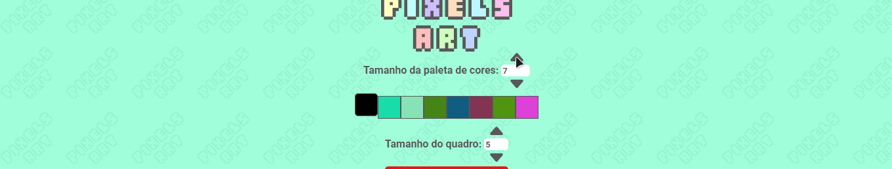
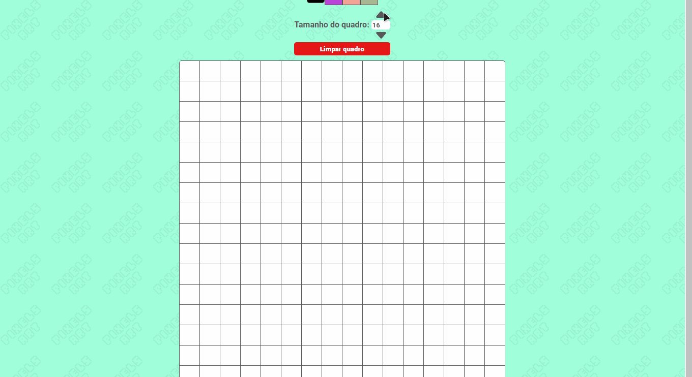

# 🎨 Pixels Art

> Este foi o terceiro projeto que realizei como `Tryber`

Este foi meu primeiro projeto com a triade da web (`HTML`, `CSS` e `JavaScript`), utilizando conceitos básicos do `DOM`, como `eventListers` e `seletores`.

A ideia do projeto era construir uma paleta de cores aleatórias e um quadro de pixels, onde os usuários utilizando as cores da paleta poderiam criar obras de arte INCRÍVEIS.
## 🛠️ Construído com
  🔹<a href="https://developer.mozilla.org/en-US/docs/Web/HTML">
    
    - HTML
  </a>

🔹<a href="https://developer.mozilla.org/en-US/docs/Web/CSS">
    
     - CSS
  </a>

🔹<a href="https://developer.mozilla.org/en-US/docs/Web/JavaScript">
  
    - JavaScript
</a>

## 🖱️Uso
O foco da aplicação é a criação de incríveis obras de arte.

<a href="#">
  
</a>

### 🌈Paleta de cores

As cores são geradas aleatoriamente, o que pode instigar o uso da criatividade.

O algoritmo de geração de cores faz um checagem e gera as cores totalmente diferentes entre si, sem repetições.

É possivel alterar o tamanho da paleta de cores, utilizado os botões de incremento e decremento ou digitar uma quantidade diretamente no campo de input.
> A quantidade mínima de cores é 3 e a máxima é 500

<a href="#">
  
</a>

### 🖼️ Quadro de pixels

Também é possivel alterar o tamanho do quadro de pixels, utilizado os botões de incremento e decremento ou digitar uma quantidade diretamente no campo de input.
> A quantidade mínima de pixels é 5 e a máxima é 50
<a href="#">
  
</a>

###

A aplicação pode ser acessada através do deploy realizado na plataforma gratuita do <a href="https://vercel.com/" >Vercel</a>:

🔹<a  href="https://miguel-retroz-pixels-art.vercel.app" target="_blank"> Vercel - Deploy da aplicação</a>

## 🪛 Desenvolvimento
Basta realizar o clone do projeto e abrir o arquivo ``index.html`` em seu navegador para executar a aplicação.

### ⚙️Scripts
> O projeto possui dois scripts.

Para executá-los é necessário realizar a instalação das dependências:
```bash
npm install
```

Para executar o `ESLint` e realizar a análise estática do código **JavaScript**:
```bash
npm run lint
```

Para executar o `StyleLint` e realizar a análise estática do código **CSS**:
```bash
npm run lint:styles
```

## 👤Contatos
🔹<a href = "mailto:contato.miguelretroz@gmail.com" target="_blank">
  
  Gmail - contato.miguelretroz@gmail.com
</a>

🔹<a href="https://www.linkedin.com/in/miguelretroz/" target="_blank">
  
  Linkedin - Miguel Retroz
</a>

🔹<a href = "https://www.instagram.com/miguel_retroz/" target="_blank">
  
  Instagram - @miguel_retroz
</a>
